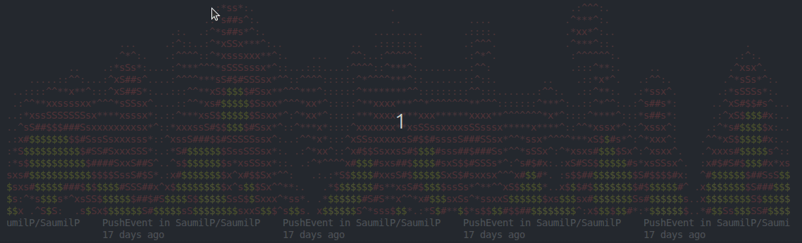
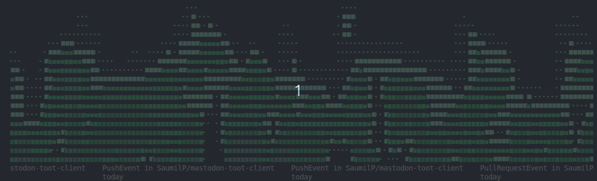

# GitHub Animated Git Log



A [GitHub CLI](https://cli.github.com/) extension that turns your terminal into a festive, animated Yule log :fire: based on your GitHub activity!

Enjoy your Git logs over toasted marshmallows and your favorite beverage :beers:

Vibe-coded with GitHub Copilot Agent and GPT-5.1 the week before Christmas 2025.

## Requirements

- `gh` (GitHub CLI) installed and configured
- A modern terminal that supports ANSI colors
- Rust toolchain (for building from source)

## Installation

### From Source

```bash
git clone https://github.com/SaumilP/gh-yule-gitlog-rs.git
cd gh-rs-animated-gitlog
cargo build --release
```

### As GitHub CLI Extension

```bash
gh extension install SaumilP/gh-yule-gitlog-rs
```

## Usage

Run the extension with:

```bash
gh yule-gitlog-rs
```


Or try the experimental `--contribs` flag to see a Yule log themed around your GitHub contributions:

```bash
gh yule-gitlog-rs --contribs
```



### Command Line Options

- `--username <USERNAME>`: GitHub username (default: SaumilP)
- `--past-days <DAYS>`: Number of past days to look back (default: 365)
- `--contribs`: Filter for contribution events only

### Controls

- Press `q`, `Esc`, or `Ctrl+C` to exit the animation

## Inspiration

I was surfing Netflix the other night and was astonished at how many [branded Yule logs there were](https://youtu.be/ytMdeo9Re1k?si=Fowy4F-40MmdwMcp). I figured GitHub should get in on that action! Also inspired by [@msimpson's curses-based ASCII art fire art from back in the day](https://gist.github.com/msimpson/1096950).

## License

This project is licensed under the MIT License - see the [LICENSE](LICENSE) file for details.
